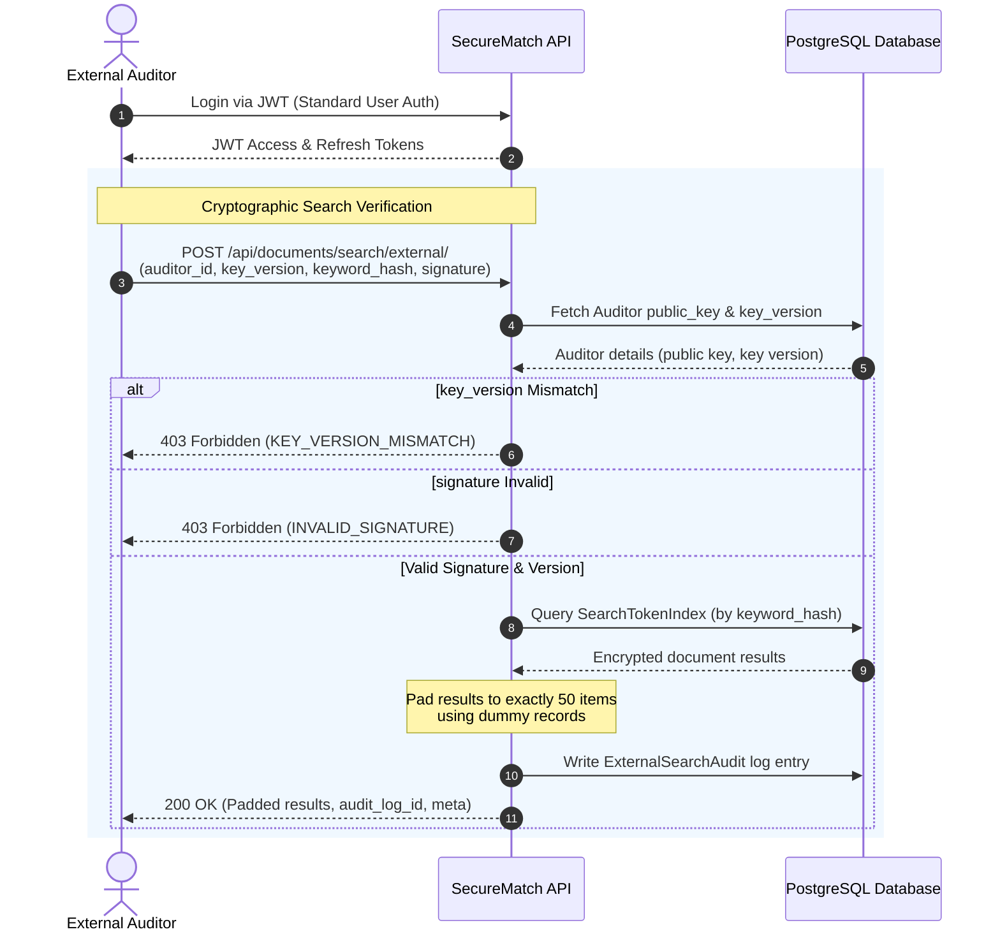

# Authentication and Authorization Documentation

This document outlines the authentication and authorization design implemented in the `safe-search` project. The system employs a dual-authentication mechanism: **JWT-based Authentication** for standard user workflows, and **Hardened Public-Key Signature Verification** for external audit operations.

---

## 1. User Authentication (JWT)

User authentication is implemented using JSON Web Tokens (JWT) via the `djangorestframework-simplejwt` package.

### Configuration
JWT settings are configured in [settings.py](file:///C:/Users/Priyanka/OneDrive/Documents/GitHub/safe-search/backend/securematch/securematch/settings.py#L185-L194):
- **Access Token Lifetime**: 15 minutes.
- **Refresh Token Lifetime**: 7 days.
- **Token Rotation**: Enabled (`ROTATE_REFRESH_TOKENS: True`). When a new access token is requested using a refresh token, a new refresh token is issued, and the previous refresh token is immediately blacklisted (`BLACKLIST_AFTER_ROTATION: True`).

### User Model
The system uses a custom user model [User](file:///C:/Users/Priyanka/OneDrive/Documents/GitHub/safe-search/backend/securematch/accounts/models.py#L4-L7) extending Django's `AbstractUser`.

### API Endpoints
All authentication routes are defined in [urls.py](file:///C:/Users/Priyanka/OneDrive/Documents/GitHub/safe-search/backend/securematch/accounts/urls.py) and mapped under `/api/auth/`:

*   **Login** ([LoginView](file:///C:/Users/Priyanka/OneDrive/Documents/GitHub/safe-search/backend/securematch/accounts/views.py#L13-L69)):
    *   **Path**: `POST /api/auth/login/`
    *   **Throttling**: Limited to 5 requests per minute per IP to mitigate brute-force attempts.
    *   **Payload**:
        ```json
        {
          "username": "user123",
          "password": "securepassword"
        }
        ```
    *   **Response (Success)**:
        ```json
        {
          "status": "success",
          "data": {
            "access": "eyJhbGciOi...",
            "refresh": "eyJhbGciOi...",
            "user": {
              "id": 1,
              "username": "user123",
              "role": "Internal Analyst",
              "email": "user@company.com",
              "date_joined": "2026-07-09T10:45:51Z"
            }
          }
        }
        ```
    *   **Response (Failure)**: Standardized generic error messages are returned to prevent username enumeration (e.g., `INVALID_CREDENTIALS` or `USER_DISABLED`).

*   **Logout** ([LogoutView](file:///C:/Users/Priyanka/OneDrive/Documents/GitHub/safe-search/backend/securematch/accounts/views.py#L71-L103)):
    *   **Path**: `POST /api/auth/logout/`
    *   **Security**: Requires authentication. Blacklists the supplied refresh token in the backend.

*   **Token Refresh** ([TokenRefreshView](file:///C:/Users/Priyanka/OneDrive/Documents/GitHub/safe-search/backend/securematch/accounts/urls.py#L8)):
    *   **Path**: `POST /api/auth/refresh/`
    *   **Payload**: Sends the current refresh token to receive a rotated refresh token and a new short-lived access token.

*   **Current User Info** ([CurrentUserView](file:///C:/Users/Priyanka/OneDrive/Documents/GitHub/safe-search/backend/securematch/accounts/views.py#L105-L115)):
    *   **Path**: `GET /api/auth/me/`
    *   **Security**: Requires authentication. Returns details of the currently logged-in user.

*   **Change Password** ([ChangePasswordView](file:///C:/Users/Priyanka/OneDrive/Documents/GitHub/safe-search/backend/securematch/accounts/views.py#L117-L149)):
    *   **Path**: `POST /api/auth/change-password/`
    *   **Security**: Requires authentication.
    *   **Validation**: Validates the old password, checks that the new password is not identical to the old password, and applies Django's configured password validators. Calls `update_session_auth_hash` to keep the user's session active.

---

## 2. Role-Based Access Control (RBAC)

The system manages authorization permissions by reading the Django groups associated with each user.

### Roles Definition
Roles are defined in [constants.py](file:///C:/Users/Priyanka/OneDrive/Documents/GitHub/safe-search/backend/securematch/accounts/constants.py):
1.  **Super Administrator** (`Super Administrator`): Full administrative controls (managing auditors, viewing metrics).
2.  **Internal Analyst** (`Internal Analyst`): Performs document uploads and internal secure searches.
3.  **Compliance Officer** (`Compliance Officer`): Audits system metrics and inspects auditor query logs.
4.  **External Auditor** (`External Auditor`): Authorized to execute hardened search queries on encrypted indexes.
5.  **Read Only Analyst** (`Read Only Analyst`): Can query matching indexes internally but cannot modify documents or write audit logs.

### Dynamic Role Derivation
A user's primary role is determined dynamically from their database group list in [get_primary_role](file:///C:/Users/Priyanka/OneDrive/Documents/GitHub/safe-search/backend/securematch/accounts/utils.py#L3-L18). If a user belongs to multiple groups, the system assigns the primary role based on alphabetical sorting. If no group is assigned, it defaults to `"No Role Assigned"`. Lookups are cached on the user instance to avoid duplicate database hits.

### Permissions Implementation
Custom permissions are constructed on top of Django REST Framework's base permission classes in [permissions.py](file:///C:/Users/Priyanka/OneDrive/Documents/GitHub/safe-search/backend/securematch/accounts/permissions.py):
*   [IsSuperAdministrator](file:///C:/Users/Priyanka/OneDrive/Documents/GitHub/safe-search/backend/securematch/accounts/permissions.py#L24-L26)
*   [IsInternalAnalyst](file:///C:/Users/Priyanka/OneDrive/Documents/GitHub/safe-search/backend/securematch/accounts/permissions.py#L28-L30)
*   [IsComplianceOfficer](file:///C:/Users/Priyanka/OneDrive/Documents/GitHub/safe-search/backend/securematch/accounts/permissions.py#L32-L34)
*   [IsExternalAuditor](file:///C:/Users/Priyanka/OneDrive/Documents/GitHub/safe-search/backend/securematch/accounts/permissions.py#L36-L38)
*   [IsReadOnlyAnalyst](file:///C:/Users/Priyanka/OneDrive/Documents/GitHub/safe-search/backend/securematch/accounts/permissions.py#L40-L42)
*   **Helper Classes**:
    *   [IsInternalUser](file:///C:/Users/Priyanka/OneDrive/Documents/GitHub/safe-search/backend/securematch/accounts/permissions.py#L45-L50) (Allows `Internal Analyst`, `Compliance Officer`, and `Super Administrator`)
    *   [IsAdministrator](file:///C:/Users/Priyanka/OneDrive/Documents/GitHub/safe-search/backend/securematch/accounts/permissions.py#L52-L57) (Allows `Super Administrator` only)

---

## 3. External Auditor Authentication (Hardened PEKS-Like)

In addition to standard user authentication, external search requests are subject to strict cryptographic verification to prevent tampering, token leakage, or unauthorized search queries.

### Cryptographic Verification Flow
When an external auditor performs a search at `POST /api/documents/search/external/`, the server verifies the request through a multi-factor checks:

1.  **Public Key Setup**: During the creation of an auditor record via `POST /api/documents/auditor/create/`, an RSA-2048 keypair is generated. The public key is stored in the database, and the private key is returned to the auditor only once.
2.  **Signature Verification**: The auditor must sign the deterministic `keyword_hash` using their private key. The API request expects:
    *   `auditor_id`: The database identifier for the auditor.
    *   `key_version`: The integer version of the auditor's key.
    *   `keyword_hash`: The hashed keyword representation.
    *   `signature`: The RSA digital signature of the `keyword_hash`.
3.  **Validation Check**: The backend verifies that the key version matches the active database version and validates the signature using the auditor's public key through [verify_signature](file:///C:/Users/Priyanka/OneDrive/Documents/GitHub/safe-search/backend/securematch/crypto_engine/peks.py).

### Hardened Privacy Safeguards
-   **Result Padding**: To prevent side-channel leaks based on result size (which could reveal information about the search term), the backend pads the response to a constant size of **50 items** (`MAX_EXTERNAL_RESULTS`). If the match count is fewer than 50, dummy payloads containing zero-filled nonces and ciphertexts are appended.
-   **Logging & Frequency Monitoring**: Every query triggers a record in the `ExternalSearchAudit` table to track success, execution latency, matching statistics, and key versions. The API monitors search frequency to alert/limit queries.



### Key Management & Rotation
-   **Rotation API** ([RotateAuditorKeyView](file:///C:/Users/Priyanka/OneDrive/Documents/GitHub/safe-search/backend/securematch/documents/views.py#L551-L589)): Administrators can rotate keys using `POST /api/documents/auditor/rotate-key/`. This generates a new RSA keypair, increments the version number in the database, and returns the new private key once.
-   **Identity Verification Probe** ([VerifyAuditorCredentialsView](file:///C:/Users/Priyanka/OneDrive/Documents/GitHub/safe-search/backend/securematch/documents/views.py#L375-L416)): Validates the active key version by requiring the auditor to sign `"auditor-probe:<auditor_id>"`.
